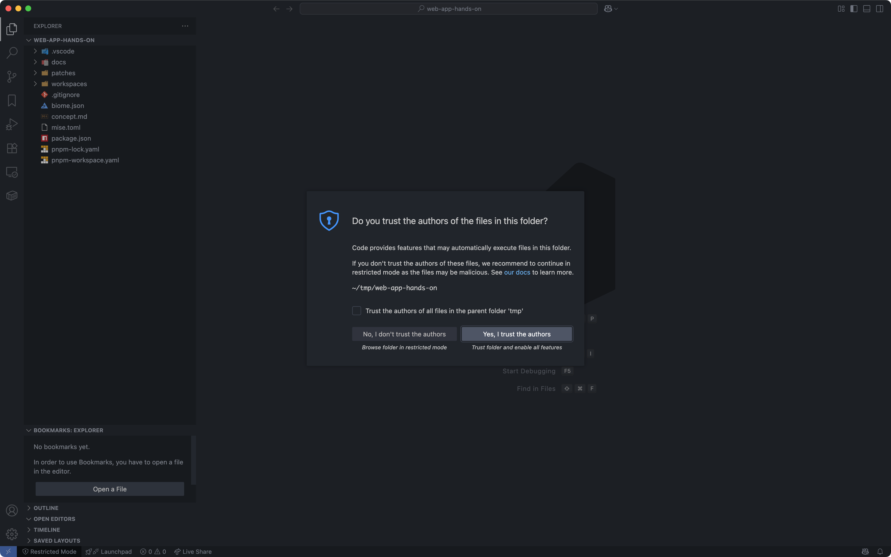
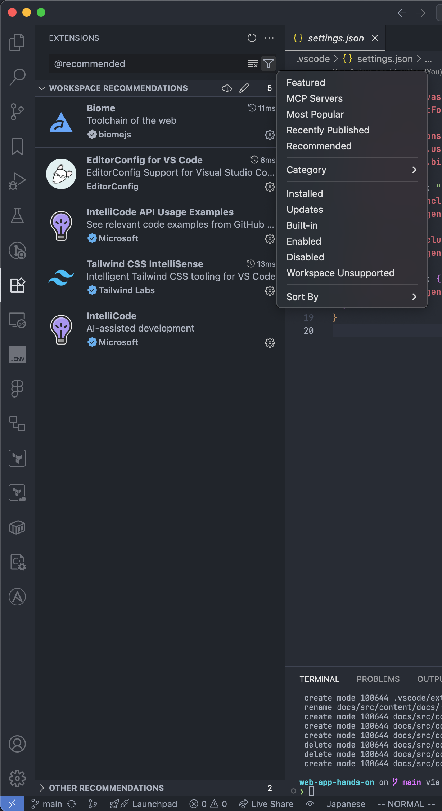

import { Aside } from "@astrojs/starlight/components"

ここからは実際にソースコードを変更しながら、Webアプリの開発を進めていきます。

## ソースコードを取得する

まずは今回使用するソースコードを入手しましょう。

ターミナルを起動し、適当なディレクトリ(Windowsの場合はWSL2上のディレクトリ)に移動します。
その後、以下のコマンドでソースコードを入手します。

```bash
git clone https://github.com/tuatmcc/web-app-hands-on.git
```

<Aside type="note">
  このコマンドは、Gitのリポジトリをクローンするコマンドです。
	今回はソースコードのダウンロードのためだけに使用しますが、本来はバージョン管理によってソースコードを管理するために使用します。
</Aside>

コマンド実行後、`web-app-hands-on`ディレクトリが作成されているはずです。
そのディレクトリを`code`コマンドで開きましょう。

```bash
code web-app-hands-on
```

## VSCodeの準備

場合によってはVSCodeを開くとフォルダーを信頼するかどうかのダイアログが表示されることがあります。
その場合は「Yes, I trust the authors」を選択してください。



次に、必要な拡張機能をインストールします。
右のパネルから「拡張機能」を開き、上の検索欄に「`@recommended`」と入力するか、右のフィルターボタンから「Recommended」を選択します。
するとワークスペースのおすすめ拡張機能が表示されるため、全てインストールしてください。



これでVSCodeの準備は完了です。

## 必要なツールと依存関係のインストール

必要なツールと依存関係をインストールします。
まずは`Ctrl + J`でターミナルを開き、以下のコマンドを実行します。

```bash
mise trust
mise install
```

これで今回使用するNode.jsとpnpmがインストールされます。

<Aside type="note">
	このコマンドでは `mise.toml` に記載されたツールをインストールします。
	`mise.toml` はデフォルトで信頼されていないため、 `mise trust` で信頼をしてから `mise install` でツールのインストールを行っています。
</Aside>

次に依存関係のインストールを行います。
以下のコマンドを実行してください。

```bash
pnpm install
```

これで依存関係のインストールは完了です。

**ここで一度VSCodeを再起動します。**
`Ctrl + Shift + P`でコマンドパレットを開き、`Reload`と入力し、`Developer: Reload Window`を選択してVSCodeを再起動してください。
これをしないと`mise`や`pnpm`でインストールしたツールをVSCodeがうまく認識してくれないことがあります。

## 動作確認

ここまでに手順できちんと開発環境の構築ができたかを確認してみましょう。
`Ctrl + J`でターミナルを開き、以下のコマンドを実行してください。

```bash
cd workspaces/app
pnpm dev
```

コマンドを実行した状態で `http://localhost:5173` にアクセスして、こんな感じのページが表示されればOKです。
ちなみに終了する場合は `Ctrl + C` か `q + Enter` です。


まだ何もありませんが、ここから実際にソースコードを変更しながらWebアプリの開発を進めていきます！
なお、これ以降のターミナルでのコマンド実行は全て `workspaces/app` ディレクトリ上を想定しています。他のディレクトリで実行してもうまく行かないので注意してください。
