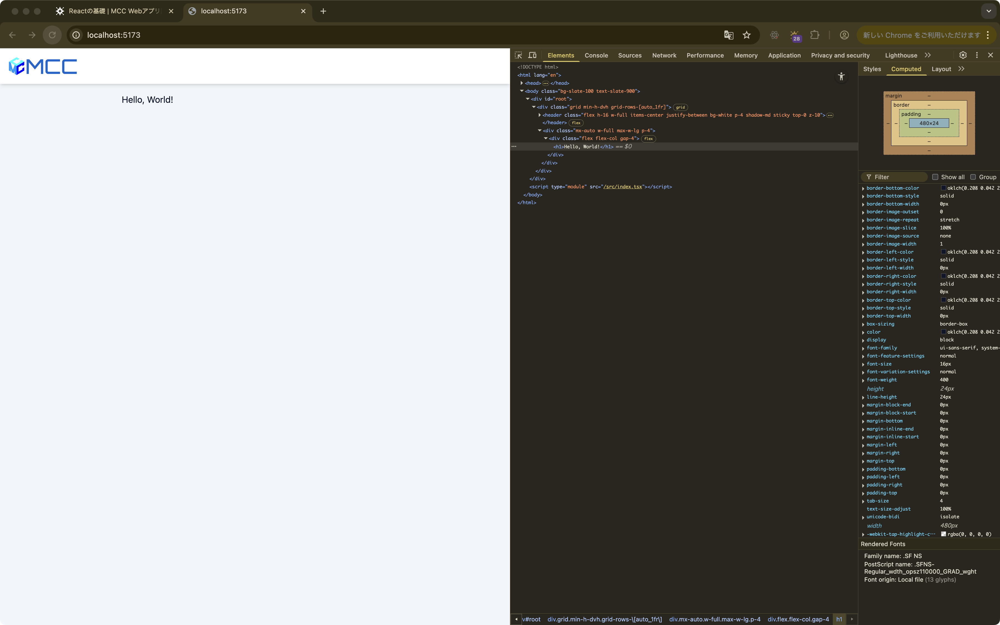
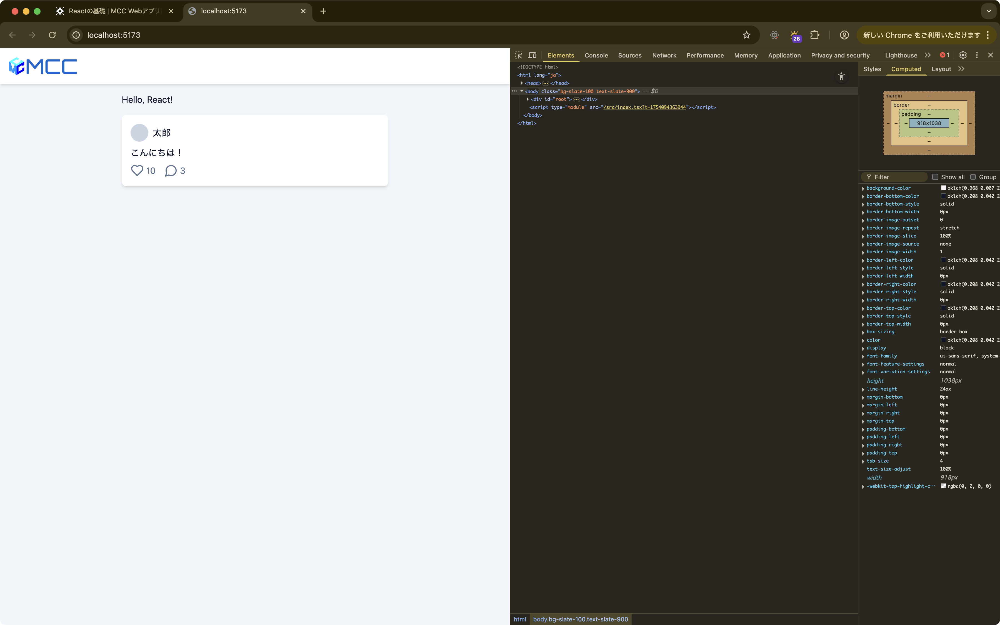
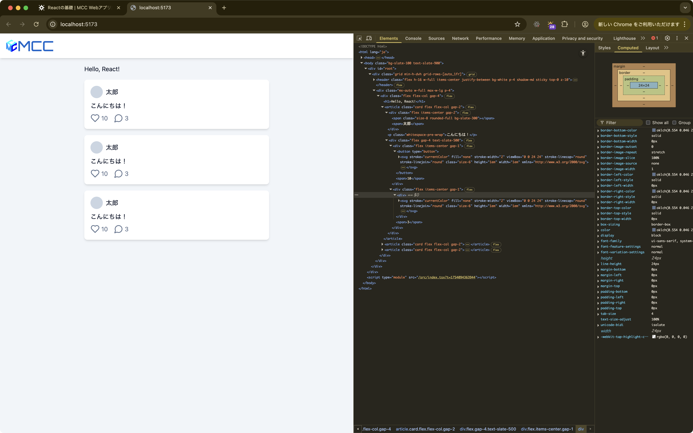

import { Aside } from "@astrojs/starlight/components"

ここからはReactの基礎を学んでいきます。

## 現状のコード確認

まずは既存のコードを見てみましょう。
`workspaces/app/src/routes/index.tsx` を開いてください。

<Aside type="caution">
	`workspaces/app/src/index.tsx` と混同しないように注意してください。
</Aside>

```tsx title="workspaces/app/src/routes/index.tsx"
import { createFileRoute } from "@tanstack/react-router";

export const Route = createFileRoute("/")({
	component: Page,
});

function Page() {
	return (
		<div className="flex flex-col gap-4">
			<h1>Hello, World!</h1>
		</div>
	);
}
```

いろいろなコードが書かれていますが、注目してほしいのは `Page` 関数の部分です。

この `Page` 関数は、**Reactコンポーネント**と呼ばれるものです。
コンポーネントとは、一言で言うと「画面の部品」のことです。
例えば、レゴブロックのように、小さな部品を組み合わせて大きなものを作ることができます。

- ボタンやテキスト入力欄のような小さな部品
- ヘッダーやサイドバーのような中くらいの部品  
- ページ全体のような大きな部品

これらすべてがコンポーネントとして作ることができます。

それでは、この `Page` コンポーネントがどのように動くのか、コードを一行ずつ見ていきましょう。

```tsx {1}
function Page() {
	return (
		<div className="flex flex-col gap-4">
			<h1>Hello, World!</h1>
		</div>
	);
}
```

最初の行では`Page`という名前の関数を定義しています。`function`キーワードを使用することでJavaScriptでは関数の定義が可能です。

```tsx {2-6}
function Page() {
	return (
		<div className="flex flex-col gap-4">
			<h1>Hello, World!</h1>
		</div>
	);
}
```

2-6行目は複数行に渡る`return`文です。`return`文は、この関数が何を表示するかを決めるためのキーワードです。
`()`で囲んでいるのは、複数行にわたって書かれているJSXコードをまとめるためです。

中身を詳しく見てみましょう。

- `<div>`は**JSX要素**と呼ばれるものです。JSXとは、HTMLのような見た目でUIの構造を書けるJavaScriptの拡張記法です。
- `className="flex flex-col gap-4"`は、この`<div>`にCSSクラスを適用してスタイルを設定しています（HTMLの`class`と同じ役割ですが、Reactでは`className`と書きます）
- `<h1>Hello, World!</h1>`は、見出しテキストを表示するための要素です
- `</div>`で、最初に開いた`<div>`タグを閉じています

つまり、この関数は「Hello, World!」という見出しを含む`<div>`要素を画面に表示するということになります。

<Aside type="note">
	JSXで書かれたコードはそのままでは実行できないので、コンパイラやトランスパイラを通じて通常のJavaScriptコードに変換されます。
	このコードでは、変換されると以下のようなコードになります。

	```tsx
	import { jsx as _jsx } from "react/jsx-runtime";

	// 省略

	function Page() {
		return _jsx("div", {
			className: "flex flex-col gap-4",
			children: _jsx("h1", {
				children: "Hello, World!",
			}),
		});
	}
	```

	実際はこのようなコードになるため、`jsx`関数を直接使っても技術的には問題ありませんが、読みにくい上に書きにくいため、JSXという記法があるのです。
</Aside>

次に実際に記述されているコードがどのように動いているかを確認してみましょう。

まずは前章で起動した開発サーバーが起動していることを確認して、 `http://localhost:5173` にアクセスしてください。
(もしも終了してしまった場合は`pnpm dev`で再起動してください)


この状態で、「Hello, World!」と書かれたところで右クリックをし、「検証」を選択してください。
すると、ブラウザの開発者ツールが開きます。
開発者ツールはWebアプリ開発者をサポートするためのツールで、ブラウザの機能を使ってコードを確認したり、デバッグしたりすることができます。



開発者ツールのElementsタブでは現在描画されているHTMLの構造を確認することができます。
確認してみると、先ほどの`Page`コンポーネントで記述されていた`<div>`タグと`<h1>`タグがそのままHTMLとして表示されていることがわかります。

<Aside type="note">
	もしかしたら`<div>`タグに設定した`className="flex flex-col gap-4"`が`class="flex flex-col gap-4"`になっていることに気づくかもしれません。
	これはReactが`className`を`class`に変換しているためです。
	なぜこのようなことをするかというと、`class`はJavaScriptの予約語であるためです。
	そこでReactでは`className`という名前を使って、HTMLの`class`属性を指定します。
	このように、ReactのJSXとHTMLは必ずしも1対1で対応しているわけではないことに注意してください。
	(とはいえ、基本的には1対1で対応しています)
</Aside>

このように、JSXで記述されたコードは実際にはHTMLとして描画されていることがわかります。
また、ブラウザの開発者ツールを使うことで、Webアプリの効率的な検証やデバッグができます。

## コードを変更してみよう

現状のコードを確認できたところで、実際にコードを変更してみましょう。
「Hello, World!」と書かれたところを「Hello, React!」に変更してください。

```tsx {4}
function Page() {
	return (
		<div className="flex flex-col gap-4">
			<h1>Hello, React!</h1>
		</div>
	);
}
```

変更して保存後、ブラウザを確認すると、「Hello, React!」と表示されていることがわかります。
`pnpm dev`で立ち上げた開発サーバーには**ホットリロード**機能があり、ソースコードの変更が自動的に反映されます。
(たまにバグるので、その場合はブラウザでページの再読み込みをしたり、開発サーバーを再起動してみたりしてください)

### コンポーネントを表示してみよう

今回はTwitter風のアプリを作るので、投稿の表示が必要です。
投稿の表示をするためのコンポーネントはすでに用意しておきました。
`workspaces/app/src/components/Post.tsx` を開いてください。

```tsx title="workspaces/app/src/components/Post.tsx"
import { LuHeart, LuMessageCircle } from "react-icons/lu";

export function Post() {
	return (
		<article className="card flex flex-col gap-2">
			<div className="flex items-center gap-2">
				<span className="size-8 rounded-full bg-slate-300" />
				<span>太郎</span>
			</div>

			<p className="whitespace-pre-wrap">こんにちは！</p>

			<div className="flex gap-4 text-slate-500">
				<div className="flex items-center gap-1">
					<button type="button">
						<LuHeart className="size-6" title="いいね" />
					</button>
					<span>10</span>
				</div>
				<div className="flex items-center gap-1">
					<div>
						<LuMessageCircle className="size-6" title="返信" />
					</div>
					<span>3</span>
				</div>
			</div>
		</article>
	);
}
```

`Post.tsx`には`Post`という名前のコンポーネントが定義されています。少し複雑ですが、やっていることは先程の`Page`コンポーネントと同じです。
`Page`との明確な違いとして、`function`の前に`export`キーワードがあります。
`export`キーワードはJavaScriptの文法で、この関数(コンポーネント)を他のファイルから使えるようにするためのキーワードです。

さて、これを`Page`コンポーネントで表示してみましょう。
以下のようにコードを変更します。

```tsx title="workspaces/app/src/routes/index.tsx" ins={2,12}
import { createFileRoute } from "@tanstack/react-router";
import { Post } from "../components/Post";

export const Route = createFileRoute("/")({
	component: Page,
});

function Page() {
	return (
		<div className="flex flex-col gap-4">
			<h1>Hello, React!</h1>
			<Post />
		</div>
	);
}
```

`import`文は他のファイルからコードを読み込むためのキーワードです。
`import ... `の部分でファイル内の関数や変数を指定し、`from ...`の部分で読み込むファイルを指定します。
コンポーネントを表示する場合は`<div>`タグなどと同様で、`<Post />`のように記述します。
JSXでは小文字で始まるタグは普通のタグ、大文字で始まるタグはコンポーネントを表します。
また、子要素を持たないタグの場合は`<Post></Post>`を`<Post />`と省略することができます。

ブラウザを確認すると、`Post`コンポーネントが表示されていることがわかります。



コンポーネントは再利用が可能なため、複数置くこともできます。試しに`Post`コンポーネントを3つ表示してみましょう。

```tsx title="workspaces/app/src/routes/index.tsx" ins={12-14}
import { createFileRoute } from "@tanstack/react-router";
import { Post } from "../components/Post";

export const Route = createFileRoute("/")({
	component: Page,
});

function Page() {
	return (
		<div className="flex flex-col gap-4">
			<h1>Hello, React!</h1>
			<Post />
			<Post />
			<Post />
		</div>
	);
}
```

すると、ブラウザの表示も3つになっていることがわかります。



### コンポーネントのプロパティを設定してみよう

`Post`コンポーネントを表示できたのはいいものの、これだと同じ内容しか表示されません。
そこで、`Post`コンポーネントにプロパティを設定してみましょう。

```tsx title="workspaces/app/src/components/Post.tsx" ins={3-8,11,17,21,29,36} del={10,16,20,28,35}
import { LuHeart, LuMessageCircle } from "react-icons/lu";

interface Props {
	name: string;
	content: string;
	likes: number;
	replies: number;
}

export function Post() {
export function Post({ name, content, likes, replies }: Props) {
	return (
		<article className="card flex flex-col gap-2">
			<div className="flex items-center gap-2">
				<span className="size-8 rounded-full bg-slate-300" />
				<span>太郎</span>
				<span>{name}</span>
			</div>

			<p className="whitespace-pre-wrap">こんにちは！</p>
			<p className="whitespace-pre-wrap">{content}</p>

			<div className="flex gap-4 text-slate-500">
				<div className="flex items-center gap-1">
					<button type="button">
						<LuHeart className="size-6" title="いいね" />
					</button>
					<span>10</span>
					<span>{likes}</span>
				</div>
				<div className="flex items-center gap-1">
					<div>
						<LuMessageCircle className="size-6" title="返信" />
					</div>
					<span>3</span>
					<span>{replies}</span>
				</div>
			</div>
		</article>
	);
}
```

変更箇所が多いので、順番に解説していきます。

```tsx title="workspaces/app/src/components/Post.tsx" {3-8}
import { LuHeart, LuMessageCircle } from "react-icons/lu";

interface Props {
	name: string;
	content: string;
	likes: number;
	replies: number;
}

export function Post({ name, content, likes, replies }: Props) {
	return (
		// 省略
	);
}
```

まず最初の`interface`キーワードはTypeScriptの文法で、データの形を決めるためのキーワードです。
ここでは`Props`という名前のデータの形を定義しています。
`Props`には、`name`（文字列）、`content`（文字列）、`likes`（数値）、`replies`（数値）という4つの項目が含まれることを決めています。

```tsx title="workspaces/app/src/components/Post.tsx" {3}
// 省略

export function Post({ name, content, likes, replies }: Props) {
	return (
		// 省略
	);
}
```

次に`Props`で定義したデータの形を使って、Postコンポーネントが受け取る値を指定しています。
Reactのコンポーネントでは、外から渡されるデータ（プロパティ）を関数の引数として受け取ります。

通常なら`function Post(props: Props)`と書いて、コンポーネント内では`props.name`のように使います。
しかし、これだと毎回`props.`と書くのが面倒です。

そこでJavaScriptの**分割代入**という機能を使います。
これは、オブジェクトの中身を個別の変数として受け取ることができる便利な機能です。
`function Post({ name, content, likes, replies }: Props)`と書くことで、`name`、`content`、`likes`、`replies`をそれぞれ個別の変数として直接使うことができます。

<Aside type="note">
	分割代入の使用自体は必須ではありません。`function Post(props: Props)`という書き方も有効であり、どちらを使うかは好みですが、本講座では分割代入を使用することで統一しています。
</Aside>

```tsx title="workspaces/app/src/components/Post.tsx" {8,11,18,24}
// 省略

export function Post({ name, content, likes, replies }: Props) {
	return (
		<article className="card flex flex-col gap-2">
			<div className="flex items-center gap-2">
				<span className="size-8 rounded-full bg-slate-300" />
				<span>{name}</span>
			</div>

			<p className="whitespace-pre-wrap">{content}</p>

			<div className="flex gap-4 text-slate-500">
				<div className="flex items-center gap-1">
					<button type="button">
						<LuHeart className="size-6" title="いいね" />
					</button>
					<span>{likes}</span>
				</div>
				<div className="flex items-center gap-1">
					<div>
						<LuMessageCircle className="size-6" title="返信" />
					</div>
					<span>{replies}</span>
				</div>
			</div>
		</article>
	);
}
```

`太郎`などの固定の文字が`{name}`に置き換わっています。JSXの中では`{}`で囲んだ部分に変数を書くことができます。
変数の中身が実際の値として表示されます。
例えば`<span>{name}</span>`で、`name`の中身が`"太郎"`なら、ブラウザには`<span>太郎</span>`として表示されます。

<Aside type="note">
  `{}`の中には変数だけでなく、計算式も書くことができます。
	例えば`{1 + 2}`と書けば`3`が表示されます。
	ただし、`if`文のような複雑な処理は書くことができません。条件によって表示を変えたい場合は、`{条件 ? 表示したい内容1 : 表示したい内容2}`のような書き方を使います。
</Aside>

さて、コンポーネントにプロパティを設定しましたが、コンポーネントを使う側でまだ値を設定していません。
この状態で`workspaces/app/src/routes/index.tsx`を開くと、`<Post />`の部分でエラーになっていると思います。
これは`Post`コンポーネントが`name`、`content`、`likes`、`replies`という4つのプロパティを受け取るようになっているのに、コンポーネントを使う側でそれらの値を設定していないためです。

```tsx title="workspaces/app/src/routes/index.tsx" {7-9}
// 省略

function Page() {
	return (
		<div className="flex flex-col gap-4">
			<h1>Hello, React!</h1>
			<Post />
			<Post />
			<Post />
		</div>
	);
}
```

ということで、`Post`コンポーネントに値を設定してみましょう。

```tsx title="workspaces/app/src/routes/index.tsx" ins={10-12} del={7-9}
// 省略

function Page() {
	return (
		<div className="flex flex-col gap-4">
			<h1>Hello, React!</h1>
			<Post />
			<Post />
			<Post />
			<Post name={"太郎"} content={"こんにちは！"} likes={10} replies={3} />
			<Post name={"花子"} content={"こんばんは！"} likes={20} replies={5} />
			<Post name={"太郎"} content={"おはよう！"} likes={30} replies={7} />
		</div>
	);
}
```

JSXでプロパティに値を設定する場合、`name={"太郎"}`のように`プロパティ名={値}`の形で記述します。
`{}`は変数や計算結果を渡すための記法です。

ところで`name={"太郎"}`は少し長い書き方で、実は`name="太郎"`と書くこともできます。
文字列を直接書く場合（変数ではなく、固定の文字列の場合）は`name="太郎"`のように`{}`を省略できます。
これは普通のHTMLタグで`<div className="flex flex-col gap-4">`と書くのと同じです。

ブラウザを確認すると、`Post`コンポーネントに設定した値が表示されていることがわかります。


### インタラクティブなコンポーネントを作ってみよう

このままだとただHTMLを表示できるだけで、何も面白みがありません。
そこで、`Post`コンポーネントにあるいいねボタンを押したらいいねが増えるようにしてみましょう。
`Post`コンポーネントの中で、`handleClick`という関数を宣言します。
次に、`<button>`タグの中の`onClick`プロパティに`handleClick`を設定します。


```tsx title="workspaces/app/src/components/Post.tsx" ins={4-6,20} del={19}
// 省略

export function Post({ name, content, likes, replies }: Props) {
	const handleClick = () => {
		console.log("いいねしました");
	};

	return (
		<article className="card flex flex-col gap-2">
			<div className="flex items-center gap-2">
				<span className="size-8 rounded-full bg-slate-300" />
				<span>{name}</span>
			</div>

			<p className="whitespace-pre-wrap">{content}</p>

			<div className="flex gap-4 text-slate-500">
				<div className="flex items-center gap-1">
					<button type="button">
					<button type="button" onClick={handleClick}>
						<LuHeart className="size-6" title="いいね" />
					</button>
					<span>{likes}</span>
				</div>
				<div className="flex items-center gap-1">
					<div>
						<LuMessageCircle className="size-6" title="返信" />
					</div>
					<span>{replies}</span>
				</div>
			</div>
		</article>
	);
}
```

`() => { ... }`はJavaScriptの関数を書く別の方法です（アロー関数と呼ばれます）。
`function`と基本的には同じですが、より短く書くことができるのでコンポーネント内で関数を定義する場合はよく使われます。

関数の中身の`console.log()`は、ブラウザの開発者ツールにメッセージを表示するための機能です。
画面には表示されませんが、プログラムが正しく動いているかを確認するのに非常に便利です。

`<button>`の`onClick`は、ボタンがクリックされた時に実行する関数を指定するプロパティです。
Reactでは、普通のHTMLタグに「何かが起きた時の処理」を追加することができます。

例:
- `onClick`: クリックされた時
- `onMouseOver`: マウスが乗った時  
- `onKeyPress`: キーが押された時

今回は`onClick={handleClick}`と書くことで、ボタンがクリックされた時に`handleClick`関数が実行されるようになります。
この`handleClick`という名前はもちろん自由に設定が可能ですが、Reactの流儀として`on`に設定する関数は`handle`という接頭辞をつけることが多いです。

ブラウザの開発者ツールでタブを「Console」に切り替え、いいねボタンを押すと「いいねしました」と表示されることが確認できます。
複数回クリックした場合、ログとしては出力されますが、同一のメッセージはまとめられるため、最初の「いいねしました」の隣にカウンタが表示され、その数字が増えていきます。

次に、`<Post>`コンポーネントにいいね数を「記憶」させ、クリックするたびにいいね数が増えていくようにしてみましょう。

普通のJavaScriptなら変数に値を代入すれば済みますが、Reactでは「state（ステート）」という特別な仕組みを使います。
stateは、コンポーネントが値を覚えておくための機能です。

Reactでは`useState`という関数を使ってstateを作ることができます。
いいね数をstateで管理して、ボタンをクリックするたびに数が増えるようにしてみましょう。

```tsx title="workspaces/app/src/components/Post.tsx" ins={1,12,13,16} del={7,11,15}
import { useState } from "react";
import { LuHeart, LuMessageCircle } from "react-icons/lu";

interface Props {
	name: string;
	content: string;
	likes: number;
	replies: number;
}

export function Post({ name, content, likes, replies }: Props) {
export function Post({ name, content, replies }: Props) {
	const [likes, setLikes] = useState(0);
	const handleClick = () => {
		console.log("いいねしました");
		setLikes(likes + 1); // いいね数を1増やす
	};

	return (
		// 省略
	);
}
```

`useState(0)`を呼び出すと、2つのものが返ってきます。
- `likes`: 現在のいいね数
- `setLikes`: いいね数を変更するための関数
なお、今回は`likes`, `setLikes`という名前をつけていますが、これは自由に設定が可能です。
ただ、Reactの流儀として、`[変数名, set変数名]`という名前の組み合わせを使うことが多いです。

`useState(0)`の`0`は初期値なので、いいね数は`0`から始まります。

`setLikes(likes + 1)`は、現在のいいね数に`1`を足した値を新しいいいね数として設定するという意味です。

`setLikes`を呼び出すと、Reactが自動的に画面を更新してくれます。
これにより、新しいいいね数が画面に表示されるようになります。

`Post`コンポーネントはプロパティとして`likes`を受け取らなくなったので、`workspaces/app/src/routes/index.tsx`の`<Post>`タグの中からも`likes`を削除します。

```tsx title="workspaces/app/src/routes/index.tsx" {7-9}
// 省略

function Page() {
	return (
		<div className="flex flex-col gap-4">
			<h1>Hello, React!</h1>
			<Post name={"太郎"} content={"こんにちは！"} replies={3} />
			<Post name={"花子"} content={"こんばんは！"} replies={5} />
			<Post name={"太郎"} content={"おはよう！"} replies={7} />
		</div>
	);
}
```

ブラウザを確認すると、いいねボタンをクリックするたびにいいね数が増えていることが確認できます。

各`Post`コンポーネントは、それぞれ独自のいいね数を持っています。
1つ目の`Post`のいいねボタンを押しても、2つ目や3つ目の`Post`のいいね数は変わりません。
このように、コンポーネント一つひとつが独立してstateを管理しています。

`setLikes`を呼び出すと、Reactが自動的にそのコンポーネントだけを更新して、画面に新しい値を表示してくれます。

## これまでのコード

最後に、これまでのコードをまとめておきます。

```tsx title="workspaces/app/src/routes/index.tsx"
import { createFileRoute } from "@tanstack/react-router";
import { Post } from "../components/Post";

export const Route = createFileRoute("/")({
	component: Page,
});

function Page() {
	return (
		<div className="flex flex-col gap-4">
			<h1>Hello, React!</h1>
			<Post name={"太郎"} content={"こんにちは！"} replies={3} />
			<Post name={"花子"} content={"こんばんは！"} replies={5} />
			<Post name={"太郎"} content={"おはよう！"} replies={7} />
		</div>
	);
}
```

```tsx title="workspaces/app/src/components/Post.tsx"
import { useState } from "react";
import { LuHeart, LuMessageCircle } from "react-icons/lu";

interface Props {
	name: string;
	content: string;
	replies: number;
}

export function Post({ name, content, replies }: Props) {
	const [likes, setLikes] = useState(0);
	const handleClick = () => {
		setLikes(likes + 1);
	};

	return (
		<article className="card flex flex-col gap-2">
			<div className="flex items-center gap-2">
				<span className="size-8 rounded-full bg-slate-300" />
				<span>{name}</span>
			</div>

			<p className="whitespace-pre-wrap">{content}</p>

			<div className="flex gap-4 text-slate-500">
				<div className="flex items-center gap-1">
					<button type="button" onClick={handleClick}>
						<LuHeart className="size-6" title="いいね" />
					</button>
					<span>{likes}</span>
				</div>
				<div className="flex items-center gap-1">
					<div>
						<LuMessageCircle className="size-6" title="返信" />
					</div>
					<span>{replies}</span>
				</div>
			</div>
		</article>
	);
}
```
