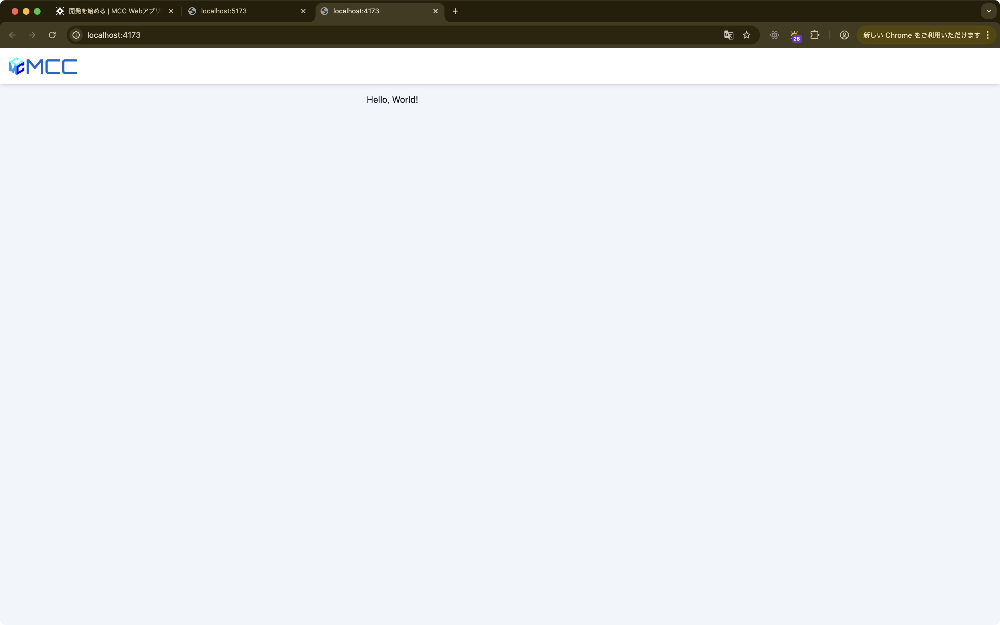

import { Aside } from "@astrojs/starlight/components"

ここからはReactの基礎を学んでいきます。

## 現状のコード確認

まずは既存のコードを見てみましょう。
`workspaces/app/src/routes/index.tsx` を開いてください。

<Aside type="caution">
	`workspaces/app/src/index.tsx` と混同しないように注意してください。
</Aside>

```tsx title="workspaces/app/src/routes/index.tsx"
import { createFileRoute } from "@tanstack/react-router";

export const Route = createFileRoute("/")({
	component: Page,
});

function Page() {
	return (
		<div className="flex flex-col gap-4">
			<h1>Hello, World!</h1>
		</div>
	);
}
```

いろいろなコードが書かれていますが、注目してほしいのは `Page` 関数の部分です。

この `Page` 関数は、**Reactコンポーネント**と呼ばれるものです。
コンポーネントとは、一言で言うと「画面の部品」のことです。
例えば、レゴブロックのように、小さな部品を組み合わせて大きなものを作ることができます。

- ボタンやテキスト入力欄のような小さな部品
- ヘッダーやサイドバーのような中くらいの部品  
- ページ全体のような大きな部品

これらすべてがコンポーネントとして作ることができます。

それでは、この `Page` コンポーネントがどのように動くのか、コードを一行ずつ見ていきましょう。

```tsx {1}
function Page() {
	return (
		<div className="flex flex-col gap-4">
			<h1>Hello, World!</h1>
		</div>
	);
}
```

最初の行では`Page`という名前の関数を定義しています。`function`キーワードを使用することでJavaScriptでは関数の定義が可能です。

```tsx {2-6}
function Page() {
	return (
		<div className="flex flex-col gap-4">
			<h1>Hello, World!</h1>
		</div>
	);
}
```

2-6行目は複数行に渡る`return`文です。`return`文は、この関数が何を表示するかを決めるためのキーワードです。
`()`で囲んでいるのは、複数行にわたって書かれているJSXコードをまとめるためです。

中身を詳しく見てみましょう。

- `<div>`は**JSX要素**と呼ばれるものです。JSXとは、HTMLのような見た目でUIの構造を書けるJavaScriptの書き方です
- `className="flex flex-col gap-4"`は、この`<div>`にCSSクラスを適用してスタイルを設定しています（HTMLの`class`と同じ役割ですが、Reactでは`className`と書きます）
- `<h1>Hello, World!</h1>`は、見出しテキストを表示するための要素です
- `</div>`で、最初に開いた`<div>`タグを閉じています

つまり、この関数は「Hello, World!」という見出しを含む`<div>`要素を画面に表示するということになります。

<Aside type="note">
	JSXで書かれたコードはコンパイラやトランスパイラを通じて通常のJavaScriptコードに変換されます。
	このコードでは、変換されると以下のようなコードになります。

	```tsx
	import { jsx as _jsx } from "react/jsx-runtime";
	import { createFileRoute } from "@tanstack/react-router";

	export const Route = createFileRoute("/")({
		component: Page,
	});

	function Page() {
		return _jsx("div", {
			className: "flex flex-col gap-4",
			children: _jsx("h1", {
				children: "Hello, World!",
			}),
		});
	}
	```

	実際はこのようなコードになるため、`jsx`関数を直接使っても技術的には問題ありませんが、読みにくい上に書きにくいため、JSXという記法があるのです。
</Aside>

次に実際に記述されているコードがどのように動いているかを確認してみましょう。

まずは前章で起動した開発サーバーが起動していることを確認して、 `http://localhost:5173` にアクセスしてください。
(もしも終了してしまった場合は`pnpm dev`で再起動してください)



この状態で、「Hello, World!」と書かれたところで右クリックをし、「検証」を選択してください。
すると、ブラウザの開発者ツールが開きます。
開発者ツールはWebアプリ開発者をサポートするためのツールで、ブラウザの機能を使ってコードを確認したり、デバッグしたりすることができます。


開発者ツールのElementsタブでは現在描画されているHTMLの構造を確認することができます。
確認してみると、先ほどの`Page`コンポーネントで記述されていた`<div>`タグと`<h1>`タグがそのままHTMLとして表示されていることがわかります。

このように、JSXで記述されたコードは実際にはHTMLとして描画されていることがわかります。
また、ブラウザの開発者ツールを使うことで、Webアプリの効率的な検証やデバッグができます。

## コードを変更してみよう

現状のコードを確認できたところで、実際にコードを変更してみましょう。
「Hello, World!」と書かれたところを「Hello, React!」に変更してください。

```tsx {4}
function Page() {
	return (
		<div className="flex flex-col gap-4">
			<h1>Hello, React!</h1>
		</div>
	);
}
```

変更して保存後、ブラウザを確認すると、「Hello, React!」と表示されていることがわかります。
`pnpm dev`で立ち上げた開発サーバーには**ホットリロード**機能があり、ソースコードの変更が自動的に反映されます。
(たまにバグるので、その場合はブラウザでページの再読み込みをしたり、開発サーバーを再起動してみたりしてください)
