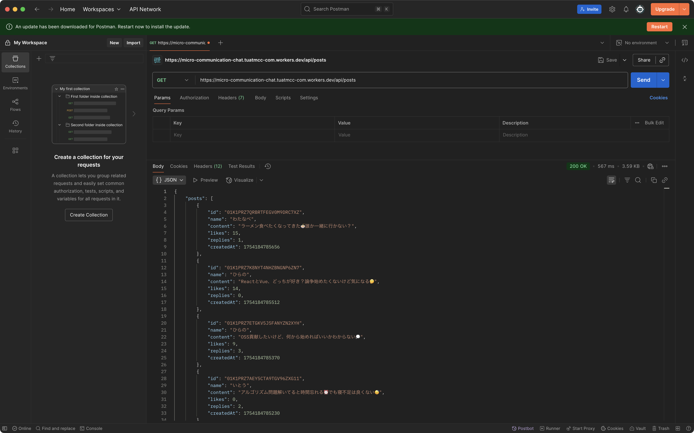
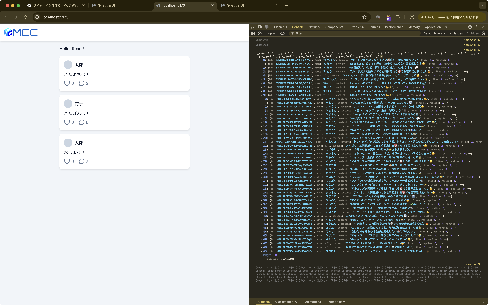
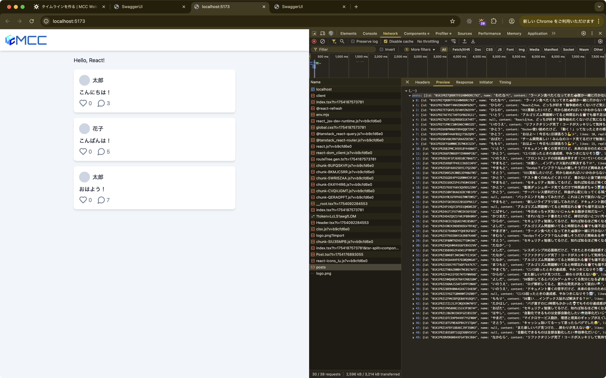

import { Aside } from "@astrojs/starlight/components"

ここからはいよいよTwitter風アプリを作っていきます。
まずはタイムラインを表示するところから作っていきましょう。

## APIの確認

まずは今回使用するAPIの仕様を確認します。
Postmanで次のリクエストを送信してください。

- メソッド: GET
- URL: `https://micro-communication-chat.tuatmcc-com.workers.dev/api/posts`

すると、次のようなレスポンスが返ってきます。(きれいに表示されない場合は、Bodyの下のセレクタを「JSON」にしてください)



このレスポンスの中身を見ると、次のようなデータが返ってきていることがわかります。

```jsonc
{
	"posts": [
		{
			"id": "01K1PRZ7QRBRTFEGV0M9DRC7XZ", // 投稿のID(投稿ごとに一意)
			"name": "わたなべ", // 投稿者の名前(nullの場合もある)
			"content": "ラーメン食べたくなってきた🍜誰か一緒に行かない？", // 投稿の内容
			"likes": 15, // いいねの数
			"replies": 1, // 返信の数
			"createdAt": 1754184785656 // 投稿の作成日時(UNIXエポックミリ秒)
		}
		// ...
	]
}
```

これは**JSON**というデータ形式で、APIで広く使われる形式です。
JSONはJavaScriptの構文に非常に似ており、JavaScriptの場合はJSON↔JavaScriptの変換が簡単にできます。

なお、このAPIはデフォルトでは最新50件の投稿のみを返します。
もっと前の投稿を取得したり、取得件数を変えたい場合はクエリパラメータの追加が必要です。
詳しいAPIの仕様や、他にどんなAPIがあるかは https://micro-communication-chat.tuatmcc-com.workers.dev/docs を参照してください。
このドキュメントからでもAPIを試すことができます。

## アプリでAPIを叩いてみる

次はReactアプリでAPIからデータを取得してみましょう。
Reactの標準機能だけでもAPIは使えますが、少し複雑になってしまいます。
そこで、APIからのデータ取得を簡単にしてくれる「TanStack Query」というライブラリを使います。
このライブラリを使うことで、簡単にAPIからデータを取得してコンポーネントで使うことができます。

`workspaces/app/src/routes/index.tsx`を開いて、次にように変更します。

```tsx title="workspaces/app/src/routes/index.tsx" ins={1-2,11-27}
import type { ListPostsResponse } from "@mcc/schema/api";
import { useQuery } from "@tanstack/react-query";
import { createFileRoute } from "@tanstack/react-router";
import { Post } from "../components/Post";

export const Route = createFileRoute("/")({
	component: Page,
});

function Page() {
	const { data } = useQuery({
		queryKey: ["posts"],
		queryFn: async () => {
			const response = await fetch(
				"https://micro-communication-chat.tuatmcc-com.workers.dev/api/posts",
			);

			if (!response.ok) {
				throw new Error("Failed to fetch posts");
			}

			const data = (await response.json()) as ListPostsResponse;
			return data.posts;
		},
	});

	console.log(data);

	return (
		<div className="flex flex-col gap-4">
			<h1>Hello, React!</h1>
			<Post name={"太郎"} content={"こんにちは！"} replies={3} />
			<Post name={"花子"} content={"こんばんは！"} replies={5} />
			<Post name={"太郎"} content={"おはよう！"} replies={7} />
		</div>
	);
}
```

TanStack Queryでは、APIからデータを取得する時に`useQuery`という関数を使います。
`useQuery`には主に2つの設定が必要です：

- `queryKey`: このデータを識別するための名前（今回は`["posts"]`）
- `queryFn`: 実際にAPIからデータを取得する処理

`queryKey`は、TanStack Queryがデータを管理するための目印のようなものです。
重要なのは`queryFn`の部分で、ここに実際のAPI呼び出しの処理を書きます。
詳しく見ていきましょう。

```tsx {3-14}
const { data } = useQuery({
	queryKey: ["posts"],
	queryFn: async () => {
		const response = await fetch(
			"https://micro-communication-chat.tuatmcc-com.workers.dev/api/posts",
		);

		if (!response.ok) {
			throw new Error("Failed to fetch posts");
		}

		const data = (await response.json()) as ListPostsResponse;
		return data.posts;
	},
});
```

`queryFn`の関数をよく見ると、`()`の前に`async`というキーワードがついています。
これは**非同期関数**というもので、時間のかかる処理（APIの呼び出しなど）を扱う時に使います。

API呼び出しは、インターネット越しにデータを取得するため時間がかかります。
その間、画面が固まってしまわないように、「処理が完了するまで待つ」という仕組みが必要になります。
それが`async`と`await`です。

JavaScriptでAPIを呼び出す時は`fetch`関数を使います。
`fetch`の前に`await`をつけることで、「APIの結果が返ってくるまで待つ」ということができます。

`fetch`の結果は`response`という変数に入ります。
`response.ok`で、APIの呼び出しが成功したかどうかをチェックしています。
もし失敗していたら（`ok`が`false`だったら）、`throw`でエラーを発生させて処理を停止します。

APIの呼び出しが成功していれば、`response.json()`でAPIから返されたJSONデータを取得します。
これも時間がかかる処理なので、`await`をつけて結果を待ちます。

`as ListPostsResponse`という部分は、TypeScriptに「このデータはこんな形になっています」と教えるためのものです。
APIから返ってくるデータの形をTypeScriptが自動で判断することはできないので、手動で指定してあげる必要があります。

最後に`return data.posts`でAPIから取得したデータのうち、`posts`の部分を返しています。

`useQuery`からは色々な情報が返ってきます：
- `data`: APIから取得したデータ
- `isLoading`: 現在データを読み込み中かどうか
- `error`: エラーが発生した場合のエラー情報
など

今回は取得したデータだけを使いたいので、`data`の部分だけを取り出しています。
`data`には、先ほど`queryFn`で`return`した投稿の一覧が入っています。
まずは正しくデータが取得できているか確認するために、`console.log(data)`でコンソールに表示しています。

うまくAPIからデータを取得できているか確認してみましょう。ブラウザの開発者ツールを開いて、「Console」タブを開いてください。
最初に`undefined`と表示され、その後に投稿データの配列が表示されるはずです。

最初に`undefined`が表示されるのは、まだAPIからデータが返ってきていない状態だからです。
少し待つと、実際のデータが表示されます。
コンソールの出力が折りたたまれている場合は、クリックすると詳細を見ることができます。



また、「Network」タブを開いてみると、`/api/posts`へのリクエストとそのレスポンスを確認することもできます。



さて、これでAPIを叩くことができました。
