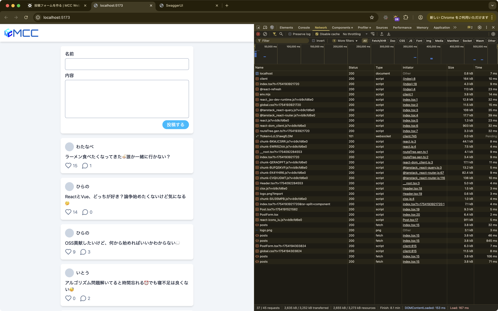
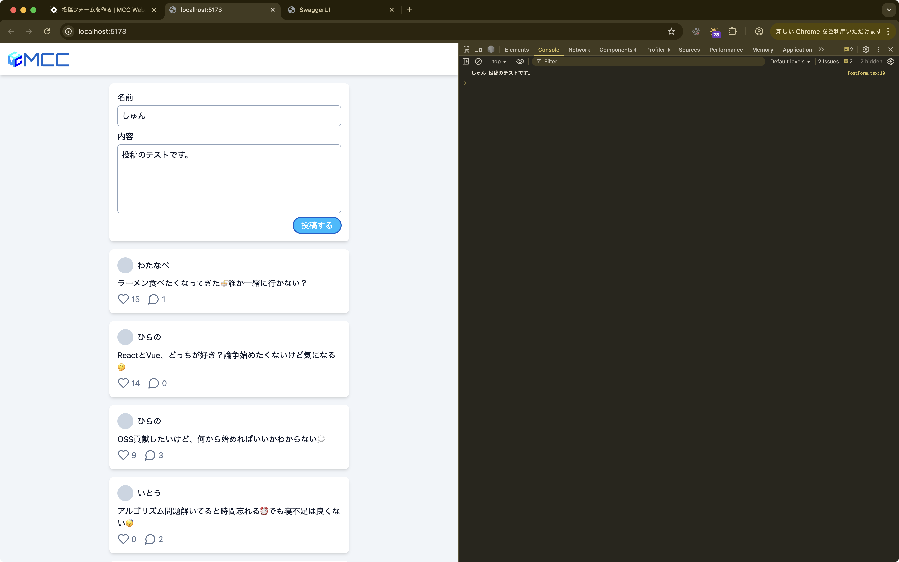

import { Aside } from "@astrojs/starlight/components"

ここまでで、タイムライン表示はできるようになりましたが、まだ新しい投稿を作成することができません。
そこで次は、新しい投稿を作成するフォームを作っていきましょう。

## 投稿フォーム用のコンポーネントを作る

まずは投稿フォーム用のコンポーネントを作ります。

`workspaces/app/src/components`に`PostForm.tsx`を作成して、次のコードを書いてください。

```tsx title="workspaces/app/src/components/PostForm.tsx"
export function PostForm() {
	return (
		<form className="card flex flex-col items-end gap-2">
			<label className="flex w-full flex-col gap-1">
				<span>名前</span>
				<input type="text" className="input" />
			</label>
			<label className="flex w-full flex-col gap-1">
				<span>内容</span>
				<textarea className="input resize-none" rows={5} />
			</label>
			<button type="submit" className="button">
				投稿する
			</button>
		</form>
	);
}
```

このフォームではいくつかのHTML要素を使用しています。

まず`<form>`は、Webページでユーザーが情報を入力するためのフォーム全体を表す要素です。
`<label>`は、各入力欄に「名前」や「内容」といった項目名を表示するために使用します。
実際の入力欄として、`<input>`と`<textarea>`を使っています。
`<input>`は1行のテキスト入力欄で、`<textarea>`は複数行のテキストを入力できる欄です。
投稿内容は長くなることが多いので、`<textarea>`を使用しています。
最後に`<button type="submit">`で、フォームの内容を送信するためのボタンを作成しています。

次にこれをページに配置します。

```tsx title="workspaces/app/src/routes/index.tsx" ins={2,11}
// 省略
import { PostForm } from "../components/PostForm";

// 省略

function Page() {
	// 省略

	return (
		<div className="flex flex-col gap-4">
			<PostForm />
			{data?.map((post) => (
				<Post
					key={post.id}
					name={post.name ?? "名無し"}
					content={post.content}
					likes={post.likes}
					replies={post.replies}
				/>
			))}
		</div>
	);
}
```

ブラウザを確認すると、一番上に投稿フォームが表示されているはずです。



## 入力したデータを受け取れるようにする

今のところ、フォームの見た目を用意しただけで、まだフォームに入力したデータをReact上で扱うことができません。
そこで、フォームに入力したデータを受け取れるようにします。
まずは入力されたデータをコンポーネントのstateで管理するようにしましょう。

```tsx title="workspaces/app/src/components/PostForm.tsx" ins={1,4-5,12-17,22-27} del={11,21}
import { useState } from "react";

export function PostForm() {
	const [name, setName] = useState("");
	const [content, setContent] = useState("");

	return (
		<form className="card flex flex-col items-end gap-2">
			<label className="flex w-full flex-col gap-1">
				<span>名前</span>
				<input type="text" className="input" />
				<input
					type="text"
					className="input"
					value={name}
					onChange={(e) => setName(e.target.value)}
				/>
			</label>
			<label className="flex w-full flex-col gap-1">
				<span>内容</span>
				<textarea className="input resize-none" rows={5} />
				<textarea
					className="input resize-none"
					rows={5}
					value={content}
					onChange={(e) => setContent(e.target.value)}
				/>
			</label>
			<button type="submit" className="button">
				投稿する
			</button>
		</form>
	);
}
```

フォームの入力値をReactで管理するために、stateを使用します。
前章で学んだ`useState`を使って、名前と投稿内容の2つのデータを別々に管理しています。

Reactでフォームの入力欄を制御する際は、`value`プロパティでstateの値を表示し、`onChange`プロパティで値の変更を検知します。
ユーザーが入力欄に文字を入力すると`onChange`が呼び出され、その中で`setState`関数を使ってstateを更新します。
この仕組みにより、Reactがフォームの状態を完全に管理できるようになります。

次に「投稿する」ボタンが押されたときの処理を追加しましょう。

```tsx title="workspaces/app/src/components/PostForm.tsx" ins={1,8-11,15-18} del={14}
import type { FormEvent } from "react";
import { useState } from "react";

export function PostForm() {
	const [name, setName] = useState("");
	const [content, setContent] = useState("");

	const handleSubmit = (e: FormEvent<HTMLFormElement>) => {
		e.preventDefault();
		console.log(name, content);
	};

	return (
		<form className="card flex flex-col items-end gap-2">
		<form
			className="card flex flex-col items-end gap-2"
			onSubmit={handleSubmit}
		>
			{/* 省略 */}
		</form>
	);
}
```

フォームの送信処理について説明します。
`<button type="submit">`がクリックされると、その親要素である`<form>`の`onSubmit`イベントが実行されます。

通常、HTMLのフォームが送信されるとページが再読み込みされてしまいますが、それではReactアプリが正常に動作しなくなってしまいます。
そこで`e.preventDefault()`を使って、この動作をキャンセルしています。
現在は動作確認のために`console.log`で入力された値をコンソールに表示していますが、後でAPIを呼び出す処理に変更していきます。

ブラウザで動作確認をしてみましょう。フォームに名前と内容を入力して「投稿する」ボタンを押すと、コンソールに入力された値が表示されるはずです。



## フォームのデータをAPIに送信する

入力データをReact上で管理できるようになったので、APIを呼び出してデータを送信します。

```tsx title="workspaces/app/src/components/PostForm.tsx" ins={1,9-34,39} del={38}
import { useMutation } from "@tanstack/react-query";
import type { FormEvent } from "react";
import { useState } from "react";

export function PostForm() {
	const [name, setName] = useState("");
	const [content, setContent] = useState("");

	const mutation = useMutation({
		mutationFn: async ({
			name,
			content,
		}: {
			name: string;
			content: string;
		}) => {
			const response = await fetch(
				"https://micro-communication-chat.tuatmcc-com.workers.dev/api/posts",
				{
					method: "POST",
					headers: {
						"Content-Type": "application/json",
					},
					body: JSON.stringify({ name: name || undefined, content }),
				},
			);

			if (!response.ok) {
				throw new Error("Failed to create post");
			}

			return response.json();
		},
	});

	const handleSubmit = (e: FormEvent<HTMLFormElement>) => {
		e.preventDefault();
		console.log(name, content);
		mutation.mutate({ name, content });
	};

	// 省略
}
```

このコードでは、TanStack Queryの`useMutation`を使ってAPIにデータを送信しています。
前回使った`useQuery`がデータの取得用だったのに対し、`useMutation`はデータの作成・更新・削除といった変更処理用の機能です。

`useMutation`の`mutationFn`には、実際にAPIを呼び出す関数を指定します。
この関数の引数では、後で`mutation.mutate()`を呼び出すときに渡すデータの型を定義しています。
今回は名前と投稿内容を送信するため、`name`と`content`を持つオブジェクトの型を指定しています。

APIの呼び出し方法にも注目してください。
URLはタイムライン表示の時と同じですが、`method`が`POST`に変わっています。
HTTPメソッドを変えることで、同じAPIでも異なる動作をさせることができます。
一般的に、データの取得には`GET`、新しいデータの作成には`POST`を使用します。

投稿データは`body`にJSON形式で送信します。
`JSON.stringify()`を使って、JavaScriptのオブジェクトをJSON文字列に変換しています。
また、`headers`で`Content-Type: application/json`を指定することで、送信データがJSON形式であることをサーバーに伝えています。

最後に、`handleSubmit`関数内で`mutation.mutate({ name, content })`を呼び出すことで、フォームのデータをAPIに送信します。

ブラウザで動作確認すると、「投稿する」を押しても何も起きてないように見えますが、ページを再読み込みするとタイムラインに新しい投稿が表示されているはずです。
これは投稿されてもタイムラインのAPIを再び呼び出しているわけではないので、最新のタイムラインが表示されていないからです。
また、API呼び出し中も「投稿する」ボタンは押せてしまうので、このままだと連打できてしまいます。そのため、API呼び出し中は「投稿する」ボタンを押せないようにしたいです。
他にも投稿ができたら投稿フォームのリセットも行いたいです。
次はこれらの問題を解決しましょう。

## フォームのユーザー体験の改善

前述の問題を一気に解決しましょう。次のようにコードを変更します。

```tsx title="workspaces/app/src/components/PostForm.tsx" ins={2,10,13-16,28} del={1,27}
import { useMutation } from "@tanstack/react-query";
import { useMutation, useQueryClient } from "@tanstack/react-query";
import type { FormEvent } from "react";
import { useState } from "react";

export function PostForm() {
	const [name, setName] = useState("");
	const [content, setContent] = useState("");

	const queryClient = useQueryClient();
	const mutation = useMutation({
		mutationFn: () => {/* 省略 */},
		onSuccess: () => {
			queryClient.invalidateQueries({ queryKey: ["posts"] });
			setContent("");
		},
	});

  // 省略

	return (
		<form
			className="card flex flex-col items-end gap-2"
			onSubmit={handleSubmit}
		>
			{/* 省略 */}
			<button type="submit" className="button">
			<button type="submit" className="button" disabled={mutation.isPending}>
				投稿する
			</button>
		</form>
	);
}
```

このコードでは、投稿完了後の処理とユーザーインターフェースの改善を行っています。

まず、`useMutation`の`onSuccess`オプションを使用しています。
これは、API呼び出しが成功した時に自動的に実行される関数です。
投稿が完了した際に実行したい処理をここに記述します。

投稿完了後の重要な処理として、`queryClient.invalidateQueries({ queryKey: ["posts"] })`を呼び出しています。
これは、指定した`queryKey`に関連するデータを「古くなった」と判断して、自動的に再取得を行う機能です。
タイムライン表示で使用した`useQuery`では`queryKey`に`["posts"]`を指定していたため、この処理により投稿完了と同時にタイムラインが最新の状態に更新されます。

また、`setContent("")`により投稿内容の入力欄をリセットしています。
これにより、投稿完了後にすぐ次の投稿を作成できるようになります。

さらに、ボタンの改善として`disabled={mutation.isPending}`を追加しています。
`mutation.isPending`は、API呼び出しが実行中かどうかを示すブール値です。
これを`disabled`プロパティに設定することで、API呼び出し中はボタンを押せないようにして、重複送信を防いでいます。

ブラウザで動作確認をすると、API呼び出し中は「投稿する」ボタンが押せなくなり、投稿が完了するとボタンが押せるようになっているはずです。
また、投稿が完了するとタイムラインのデータが再取得され、新しい投稿が表示されるようになりました。

## これまでのコード

これまでのコードをまとめておきます。

```tsx title="workspaces/app/src/routes/index.tsx"
import type { ListPostsResponse } from "@mcc/schema/api";
import { useQuery } from "@tanstack/react-query";
import { createFileRoute } from "@tanstack/react-router";
import { Post } from "../components/Post";
import { PostForm } from "../components/PostForm";

export const Route = createFileRoute("/")({
	component: Page,
});

function Page() {
	const { data } = useQuery({
		queryKey: ["posts"],
		queryFn: async () => {
			const response = await fetch(
				"https://micro-communication-chat.tuatmcc-com.workers.dev/api/posts",
			);

			if (!response.ok) {
				throw new Error("Failed to fetch posts");
			}

			const data = (await response.json()) as ListPostsResponse;
			return data.posts;
		},
	});

	return (
		<div className="flex flex-col gap-4">
			<PostForm />
			{data?.map((post) => (
				<Post
					key={post.id}
					name={post.name ?? "名無し"}
					content={post.content}
					likes={post.likes}
					replies={post.replies}
				/>
			))}
		</div>
	);
}
```

```tsx title="workspaces/app/src/components/Post.tsx"
import { LuHeart, LuMessageCircle } from "react-icons/lu";

interface Props {
	name: string;
	content: string;
	likes: number;
	replies: number;
}

export function Post({ name, content, likes, replies }: Props) {
	return (
		<article className="card flex flex-col gap-2">
			<div className="flex items-center gap-2">
				<span className="size-8 rounded-full bg-slate-300" />
				<span>{name}</span>
			</div>

			<p className="whitespace-pre-wrap">{content}</p>

			<div className="flex gap-4 text-slate-500">
				<div className="flex items-center gap-1">
					<button type="button">
						<LuHeart className="size-6" title="いいね" />
					</button>
					<span>{likes}</span>
				</div>
				<div className="flex items-center gap-1">
					<div>
						<LuMessageCircle className="size-6" title="返信" />
					</div>
					<span>{replies}</span>
				</div>
			</div>
		</article>
	);
}
```

```tsx title="workspaces/app/src/components/PostForm.tsx"
import { useMutation, useQueryClient } from "@tanstack/react-query";
import type { FormEvent } from "react";
import { useState } from "react";

export function PostForm() {
	const [name, setName] = useState("");
	const [content, setContent] = useState("");

	const queryClient = useQueryClient();
	const mutation = useMutation({
		mutationFn: async ({
			name,
			content,
		}: {
			name: string;
			content: string;
		}) => {
			const response = await fetch(
				"https://micro-communication-chat.tuatmcc-com.workers.dev/api/posts",
				{
					method: "POST",
					headers: {
						"Content-Type": "application/json",
					},
					body: JSON.stringify({ name: name || undefined, content }),
				},
			);

			if (!response.ok) {
				throw new Error("Failed to create post");
			}

			return response.json();
		},
		onSuccess: () => {
			queryClient.invalidateQueries({ queryKey: ["posts"] });
			setContent("");
		},
	});

	const handleSubmit = (e: FormEvent<HTMLFormElement>) => {
		e.preventDefault();
		mutation.mutate({ name, content });
	};

	return (
		<form
			className="card flex flex-col items-end gap-2"
			onSubmit={handleSubmit}
		>
			<label className="flex w-full flex-col gap-1">
				<span>名前</span>
				<input
					type="text"
					className="input"
					value={name}
					onChange={(e) => setName(e.target.value)}
				/>
			</label>
			<label className="flex w-full flex-col gap-1">
				<span>内容</span>
				<textarea
					className="input resize-none"
					rows={5}
					value={content}
					onChange={(e) => setContent(e.target.value)}
				/>
			</label>
			<button type="submit" className="button" disabled={mutation.isPending}>
				投稿する
			</button>
		</form>
	);
}

```
