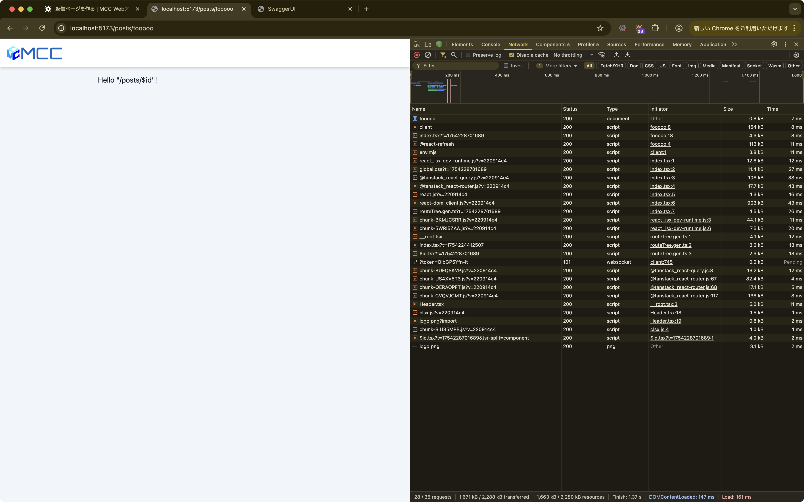
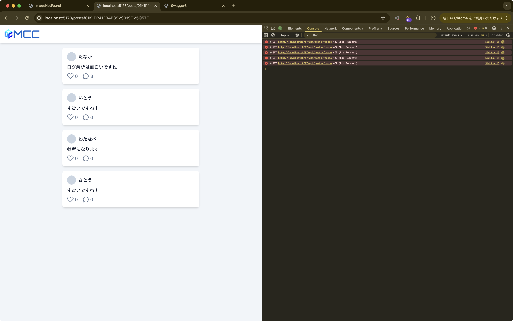

import { Aside } from "@astrojs/starlight/components"

前回まででタイムラインの表示、投稿の作成、いいね機能ができるようになりました。
次は投稿に対しての返信が見れるようにしてみましょう。

## 返信ページを作る

返信は画面を丸ごと変えたいので、新しいページを作って対応しましょう。
URLは`/posts/:id`として、`:id`には投稿のIDが入るようにします。

Webアプリでは、URLが変わると表示する画面も変わる必要があります。
このような「URLと画面の対応関係を管理する仕組み」を**ルーティング**と呼び、それを実現するライブラリを**ルーティングライブラリ**と呼びます。

今回は[TanStack Router](https://tanstack.com/router/latest)というルーティングライブラリを使っています。
TanStack Routerでは、`routes/`ディレクトリにファイルを作成すると、そのファイル名が自動的にURLに対応します。
例えば、今まで編集していた`routes/index.tsx`は`/`（トップページ）というURLに対応していました。

`workspaces/app/src/routes/posts/$id.tsx`を作成すると、開発サーバーを起動している場合すぐにこのようなコードが書き込まれるはずです。
空白のままの場合はコピペで入力してください。

```tsx title="workspaces/app/src/routes/posts/$id.tsx"
import { createFileRoute } from "@tanstack/react-router";

export const Route = createFileRoute("/posts/$id")({
	component: RouteComponent,
});

function RouteComponent() {
	return <div>Hello "/posts/$id"!</div>;
}
```

おおよそ最初の`routes/index.tsx`と同じようなコードが書き込まれているはずです。ちょっと書き換えて、整理します。

<Aside type="note">
	テクニックとして、`RouteComponent`を`Page`に書き換えたい場合、`RouteComponent`にカーソルを合わせて`F2`を押すと名前を変更するためのダイアログが出てくるので、そこに`Page`と入力してEnterを押すと、`RouteComponent`の名前が`Page`に変わります。
	`RouteComponent`が使われている箇所が全て書き換わるので、非常に便利です。
</Aside>

```tsx title="workspaces/app/src/routes/posts/$id.tsx" ins={5,9,11-15} del={4,8,10}
import { createFileRoute } from "@tanstack/react-router";

export const Route = createFileRoute("/posts/$id")({
	component: RouteComponent,
	component: Page,
});

function RouteComponent() {
function Page() {
	return <div>Hello "/posts/$id"!</div>;
	return (
		<div className="flex flex-col gap-4">
			<h1>Hello "/posts/$id"!</h1>
		</div>
	);
}
```

ブラウザで動作確認してみましょう。`/posts/{なにか適当な文字}`というURLにアクセスすると、`Hello "/posts/$id"!`と表示されるはずです。



## 返信ページへのリンクを作る

返信ページは作りましたが、そこに遷移するためのリンクがアプリ上にありません。
なので、投稿の返信ボタンを押したら返信ページに遷移するようにしましょう。

```tsx title="workspaces/app/src/components/Post.tsx" ins={2,29,32} del={28,31}
import { useMutation, useQueryClient } from "@tanstack/react-query";
import { Link } from "@tanstack/react-router";
import { LuHeart, LuMessageCircle } from "react-icons/lu";
import { apiClient } from "../lib/api";

// 省略

export function Post({ id, name, content, likes, replies }: Props) {
	// 省略

	return (
		<article className="card flex flex-col gap-2">
			<div className="flex items-center gap-2">
				<span className="size-8 rounded-full bg-slate-300" />
				<span>{name}</span>
			</div>

			<p className="whitespace-pre-wrap">{content}</p>

			<div className="flex gap-4 text-slate-500">
				<div className="flex items-center gap-1">
					<button type="button" onClick={() => mutation.mutate({ id })}>
						<LuHeart className="size-6" title="いいね" />
					</button>
					<span>{likes}</span>
				</div>
				<div className="flex items-center gap-1">
					<div>
					<Link to="/posts/$id" params={{ id }}>
						<LuMessageCircle className="size-6" title="返信" />
					</div>
					</Link>
					<span>{replies}</span>
				</div>
			</div>
		</article>
	);
}
```

TanStack Routerでは、アプリ内でページを移動する時に`Link`コンポーネントを使います。
`to`プロパティで遷移先のURLパターンを指定し、`params`プロパティでURLに含まれるパラメータ（今回は投稿のID）を指定します。

これにより、クリックした時にブラウザのURLが`/posts/投稿のID`に変わり、対応するページが表示されます。

ブラウザで動作確認すると、返信ボタンを押したらURLが変わって先程の返信ページに遷移するはずです。

## APIからデータを取得して表示する

現在は返信ページにアクセスしても`Hello "/posts/$id"!`と表示されるだけです。
実際の投稿内容と返信一覧を表示するために、APIからデータを取得しましょう。

前回と同様に`useQuery`を使ってデータを取得しますが、今回はURLから投稿のIDを取得する必要があります。

```tsx title="workspaces/app/src/routes/posts/$id.tsx" ins={1,3-4,11-29,33-51} del={32}
import { useQuery } from "@tanstack/react-query";
import { createFileRoute } from "@tanstack/react-router";
import { Post } from "../../components/Post";
import { apiClient } from "../../lib/api";

export const Route = createFileRoute("/posts/$id")({
	component: Page,
});

function Page() {
	const { id } = Route.useParams();
	const { data } = useQuery({
		queryKey: ["posts", id],
		queryFn: async () => {
			const response = await apiClient.api.posts[":id"].$get({
				param: {
					id,
				},
			});

			if (!response.ok) {
				throw new Error("Failed to fetch post");
			}

			const data = await response.json();
			return data;
		},
	});

	return (
		<div className="flex flex-col gap-4">
			<h1>Hello "/posts/$id"!</h1>
			{data?.post && (
				<Post
					id={data.post.id}
					name={data.post.name ?? "名無し"}
					content={data.post.content}
					likes={data.post.likes}
					replies={data.post.replies}
				/>
			)}
			{data?.replies.map((reply) => (
				<Post
					key={reply.id}
					id={reply.id}
					name={reply.name ?? "名無し"}
					content={reply.content}
					likes={reply.likes}
					replies={reply.replies}
				/>
			))}
		</div>
	);
}
```

ブラウザで返信がある投稿の返信ボタンを押してみると、返信ページに遷移して投稿と返信が表示されるはずです。



## これまでのコード

これまでのコードをまとめておきます。

```tsx title="workspaces/app/src/routes/index.tsx"
import { useQuery } from "@tanstack/react-query";
import { createFileRoute } from "@tanstack/react-router";
import { Post } from "../components/Post";
import { PostForm } from "../components/PostForm";
import { apiClient } from "../lib/api";

export const Route = createFileRoute("/")({
	component: Page,
});

function Page() {
	const { data } = useQuery({
		queryKey: ["posts"],
		queryFn: async () => {
			const response = await apiClient.api.posts.$get({
				query: {},
			});

			if (!response.ok) {
				throw new Error("Failed to fetch posts");
			}

			return response.json();
		},
	});

	return (
		<div className="flex flex-col gap-4">
			<PostForm />
			{data?.posts.map((post) => (
				<Post
					key={post.id}
					id={post.id}
					name={post.name ?? "名無し"}
					content={post.content}
					likes={post.likes}
					replies={post.replies}
				/>
			))}
		</div>
	);
}
```

```tsx title="workspaces/app/src/routes/posts/$id.tsx"
import { useQuery } from "@tanstack/react-query";
import { createFileRoute } from "@tanstack/react-router";
import { Post } from "../../components/Post";
import { apiClient } from "../../lib/api";

export const Route = createFileRoute("/posts/$id")({
  component: Page,
});

function Page() {
  const { id } = Route.useParams();
  const { data } = useQuery({
    queryKey: ["posts", id],
    queryFn: async () => {
      const response = await apiClient.api.posts[":id"].$get({
        param: {
          id,
        },
      });

      if (!response.ok) {
        throw new Error("Failed to fetch post");
      }

      const data = await response.json();
      return data;
    },
  });

  return (
    <div className="flex flex-col gap-4">
      {data?.post && (
        <Post
          id={data.post.id}
          name={data.post.name ?? "名無し"}
          content={data.post.content}
          likes={data.post.likes}
          replies={data.post.replies}
        />
      )}
      {data?.replies.map((reply) => (
        <Post
          key={reply.id}
          id={reply.id}
          name={reply.name ?? "名無し"}
          content={reply.content}
          likes={reply.likes}
          replies={reply.replies}
        />
      ))}
    </div>
  );
}
```

```tsx title="workspaces/app/src/components/Post.tsx"
import { useMutation, useQueryClient } from "@tanstack/react-query";
import { Link } from "@tanstack/react-router";
import { LuHeart, LuMessageCircle } from "react-icons/lu";
import { apiClient } from "../lib/api";

interface Props {
	id: string;
	name: string;
	content: string;
	likes: number;
	replies: number;
}

export function Post({ id, name, content, likes, replies }: Props) {
	const queryClient = useQueryClient();
	const mutation = useMutation({
		mutationFn: async ({ id }: { id: string }) => {
			const response = await apiClient.api.posts[":id"].like.$post({
				param: { id },
			});

			if (!response.ok) {
				throw new Error("Failed to like post");
			}

			return response.json();
		},
		onSuccess: () => {
			queryClient.invalidateQueries({ queryKey: ["posts"] });
		},
	});

	return (
		<article className="card flex flex-col gap-2">
			<div className="flex items-center gap-2">
				<span className="size-8 rounded-full bg-slate-300" />
				<span>{name}</span>
			</div>

			<p className="whitespace-pre-wrap">{content}</p>

			<div className="flex gap-4 text-slate-500">
				<div className="flex items-center gap-1">
					<button type="button" onClick={() => mutation.mutate({ id })}>
						<LuHeart className="size-6" title="いいね" />
					</button>
					<span>{likes}</span>
				</div>
				<div className="flex items-center gap-1">
					<Link to="/posts/$id" params={{ id }}>
						<LuMessageCircle className="size-6" title="返信" />
					</Link>
					<span>{replies}</span>
				</div>
			</div>
		</article>
	);
}
```

```tsx title="workspaces/app/src/components/PostForm.tsx"
import { useMutation, useQueryClient } from "@tanstack/react-query";
import type { FormEvent } from "react";
import { useState } from "react";
import { apiClient } from "../lib/api";

export function PostForm() {
	const [name, setName] = useState("");
	const [content, setContent] = useState("");

	const queryClient = useQueryClient();
	const mutation = useMutation({
		mutationFn: async ({
			name,
			content,
		}: {
			name: string;
			content: string;
		}) => {
			const response = await apiClient.api.posts.$post({
				json: {
					name: name || undefined,
					content,
				},
			});

			if (!response.ok) {
				throw new Error("Failed to create post");
			}

			return response.json();
		},
		onSuccess: () => {
			queryClient.invalidateQueries({ queryKey: ["posts"] });
			setContent("");
		},
	});

	const handleSubmit = (e: FormEvent<HTMLFormElement>) => {
		e.preventDefault();
		mutation.mutate({ name, content });
	};

	return (
		<form
			className="card flex flex-col items-end gap-2"
			onSubmit={handleSubmit}
		>
			<label className="flex w-full flex-col gap-1">
				<span>名前</span>
				<input
					type="text"
					className="input"
					value={name}
					onChange={(e) => setName(e.target.value)}
				/>
			</label>
			<label className="flex w-full flex-col gap-1">
				<span>内容</span>
				<textarea
					className="input resize-none"
					rows={5}
					value={content}
					onChange={(e) => setContent(e.target.value)}
				/>
			</label>
			<button type="submit" className="button" disabled={mutation.isPending}>
				投稿する
			</button>
		</form>
	);
}
```

```ts title="workspaces/app/src/lib/api.ts"
import type { AppType } from "@mcc/server";
import { hc } from "hono/client";

const BASE_URL = "https://micro-communication-chat.tuatmcc-com.workers.dev";

export const apiClient = hc<AppType>(BASE_URL);
```
