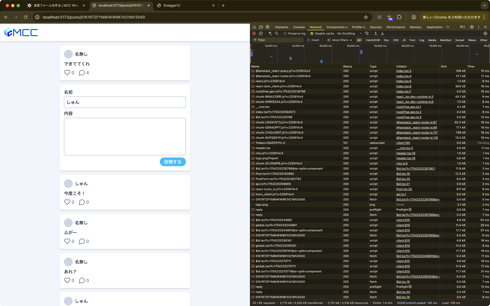

import { Aside } from "@astrojs/starlight/components"

前回まででタイムラインの表示、投稿の作成、いいね、返信の表示ができるようになりました。
次は実際に返信ができるようにしてみます。

## フォームの整理

返信フォームを新しく作ることもできますが、よく考えてみると、返信フォームの見た目や機能は既存の`PostForm`コンポーネントとほとんど同じです。
名前と内容を入力して、投稿ボタンを押すという流れは変わりません。

ただし、現在の`PostForm`は投稿作成専用のAPIを直接呼び出すようになっているため、返信用にそのまま使うことができません。
そこで、`PostForm`をより汎用的にして、投稿作成と返信作成の両方で使えるように改良してみましょう。

具体的には、API呼び出しの処理を`PostForm`から外に出して、使う側のコンポーネントが「どのAPIを呼ぶか」を決められるようにします。

最初に、`PostForm`からAPI呼び出しの処理を取り除いて、`routes/index.tsx`に移動させます。
これにより、`PostForm`はフォームの表示と入力管理だけを担当するようになります。

```tsx title="workspaces/app/src/components/PostForm.tsx" ins={49} del={1,9-35,39,48}
import { useMutation, useQueryClient } from "@tanstack/react-query";
import type { FormEvent } from "react";
import { useState } from "react";

export function PostForm() {
	const [name, setName] = useState("");
	const [content, setContent] = useState("");

	const queryClient = useQueryClient();
	const mutation = useMutation({
		mutationFn: async ({
			name,
			content,
		}: {
			name: string;
			content: string;
		}) => {
			const response = await apiClient.api.posts.$post({
				json: {
					name: name || undefined,
					content,
				},
			});

			if (!response.ok) {
				throw new Error("Failed to create post");
			}

			return response.json();
		},
		onSuccess: () => {
			queryClient.invalidateQueries({ queryKey: ["posts"] });
			setContent("");
		},
	});

	const handleSubmit = (e: FormEvent<HTMLFormElement>) => {
		e.preventDefault();
		mutation.mutate({ name, content });
	};

	return (
		<form
			className="card flex flex-col items-end gap-2"
			onSubmit={handleSubmit}
		>
		  {/* 省略 */}
			<button type="submit" className="button" disabled={mutation.isPending}>
			<button type="submit" className="button" disabled={false}>
				投稿する
			</button>
		</form>
	);
}
```

```tsx title="workspaces/app/src/routes/index.tsx" ins={2,16-41} del={1}
import { useQuery } from "@tanstack/react-query";
import { useMutation, useQuery, useQueryClient } from "@tanstack/react-query";
import { createFileRoute } from "@tanstack/react-router";
import { Post } from "../components/Post";
import { PostForm } from "../components/PostForm";
import { apiClient } from "../lib/api";

// 省略

function Page() {
	const { data } = useQuery({
		queryKey: ["posts"],
		queryFn: () => {/* 省略 */},
	});

	const queryClient = useQueryClient();
	const mutation = useMutation({
		mutationFn: async ({
			name,
			content,
		}: {
			name: string | undefined;
			content: string;
		}) => {
			const response = await apiClient.api.posts.$post({
				json: {
					name,
					content,
				},
			});

			if (!response.ok) {
				throw new Error("Failed to create post");
			}

			return response.json();
		},
		onSuccess: () => {
			queryClient.invalidateQueries({ queryKey: ["posts"] });
		},
	});

	return (
		// 省略
	);
}
```

次に、`PostForm`がより柔軟に使えるよう、以下の2つのプロパティを追加します。
- `onSubmit`: フォームが送信された時に呼び出される関数
- `isPending`: API呼び出し中かどうかを示すフラグ

```tsx title="workspaces/app/src/components/PostForm.tsx" ins={4-7,10,15-16,26} del={9,25}
import type { FormEvent } from "react";
import { useState } from "react";

interface Props {
	onSubmit: (name: string | undefined, content: string) => void;
	isPending: boolean;
}

export function PostForm() {
export function PostForm({ onSubmit, isPending }: Props) {
	// 省略

	const handleSubmit = (e: FormEvent<HTMLFormElement>) => {
		e.preventDefault();
		onSubmit(name || undefined, content);
		setContent("");
	};

	return (
		<form
			className="card flex flex-col items-end gap-2"
			onSubmit={handleSubmit}
		>
			{/* 省略 */}
			<button type="submit" className="button" disabled={false}>
			<button type="submit" className="button" disabled={isPending}>
				投稿する
			</button>
		</form>
	);
}
```

プロパティを追加したので、`routes/index.tsx`で`PostForm`を使用する際に、実際の投稿処理を行う関数とAPI呼び出し状態を渡すようにします。


```tsx title="workspaces/app/src/routes/index.tsx" ins={12-14,19} del={18}
// 省略

function Page() {
	// 省略

	const queryClient = useQueryClient();
	const mutation = useMutation({
		mutationFn: () => {/* 省略 */},
		onSuccess: () => {/* 省略 */},
	});

	const handlePostSubmit = (name: string | undefined, content: string) => {
		mutation.mutate({ name, content });
	};

	return (
		<div className="flex flex-col gap-4">
			<PostForm />
			<PostForm onSubmit={handlePostSubmit} isPending={mutation.isPending} />
			{data?.posts.map((post) => (
				<Post
					key={post.id}
					id={post.id}
					name={post.name ?? "名無し"}
					content={post.content}
					likes={post.likes}
					replies={post.replies}
				/>
			))}
		</div>
	);
}
```

画面上の動作は変わりませんが、これで`PostForm`が再利用可能になりました。
投稿作成でも返信作成でも、同じ`PostForm`コンポーネントを使うことができるようになったのです。

## 返信フォームの追加

汎用的な`PostForm`の準備が整ったので、返信ページに返信フォームを追加してみましょう。

```tsx title="workspaces/app/src/routes/posts/$id.tsx" ins={2,5,17-45,47-49,62} del={1}
import { useQuery } from "@tanstack/react-query";
import { useMutation, useQuery, useQueryClient } from "@tanstack/react-query";
import { createFileRoute } from "@tanstack/react-router";
import { Post } from "../../components/Post";
import { PostForm } from "../../components/PostForm";
import { apiClient } from "../../lib/api";

// 省略

function Page() {
	const { id } = Route.useParams();
	const { data } = useQuery({
		queryKey: ["posts", id],
		queryFn: () => {/* 省略 */},
	});

	const queryClient = useQueryClient();
	const mutation = useMutation({
		mutationFn: async ({
			name,
			content,
		}: {
			name: string | undefined;
			content: string;
		}) => {
			const response = await apiClient.api.posts[":id"].reply.$post({
				param: {
					id,
				},
				json: {
					name,
					content,
				},
			});

			if (!response.ok) {
				throw new Error("Failed to create post");
			}

			return response.json();
		},
		onSuccess: () => {
			queryClient.invalidateQueries({ queryKey: ["posts", id] });
		},
	});

	const handleReplySubmit = (name: string | undefined, content: string) => {
		mutation.mutate({ name, content });
	};

	return (
		<div className="flex flex-col gap-4">
			{data?.post && (
				<Post
					id={data.post.id}
					name={data.post.name ?? "名無し"}
					content={data.post.content}
					likes={data.post.likes}
					replies={data.post.replies}
				/>
			)}
			<PostForm onSubmit={handleReplySubmit} isPending={mutation.isPending} />
			{data?.replies.map((reply) => (
				<Post
					key={reply.id}
					id={reply.id}
					name={reply.name ?? "名無し"}
					content={reply.content}
					likes={reply.likes}
					replies={reply.replies}
				/>
			))}
		</div>
	);
}
```

このコードは投稿作成の時とよく似ていますが、重要な違いがあります。

まず、APIエンドポイントが異なります。
投稿作成では`/posts`でしたが、返信作成では`/posts/:id/reply`を使用します。
これにより、どの投稿に対する返信なのかをサーバーに伝えています。

また、データ更新の際の`queryKey`にも注目してください。
`["posts", id]`のように投稿のIDを含めることで、返信完了後にその投稿のページのデータ（元の投稿と返信一覧）を再取得して、新しい返信が即座に表示されるようになります。

ブラウザで確認すると、返信フォームが表示され、投稿ボタンを押すと返信が作成されることが確認できます。



## これまでのコード

これまでのコードをまとめておきます。

```tsx title="workspaces/app/src/routes/index.tsx"
import { useMutation, useQuery, useQueryClient } from "@tanstack/react-query";
import { createFileRoute } from "@tanstack/react-router";
import { Post } from "../components/Post";
import { PostForm } from "../components/PostForm";
import { apiClient } from "../lib/api";

export const Route = createFileRoute("/")({
	component: Page,
});

function Page() {
	const { data } = useQuery({
		queryKey: ["posts"],
		queryFn: async () => {
			const response = await apiClient.api.posts.$get({
				query: {},
			});

			if (!response.ok) {
				throw new Error("Failed to fetch posts");
			}

			return response.json();
		},
	});

	const queryClient = useQueryClient();
	const mutation = useMutation({
		mutationFn: async ({
			name,
			content,
		}: {
			name: string | undefined;
			content: string;
		}) => {
			const response = await apiClient.api.posts.$post({
				json: {
					name,
					content,
				},
			});

			if (!response.ok) {
				throw new Error("Failed to create post");
			}

			return response.json();
		},
		onSuccess: () => {
			queryClient.invalidateQueries({ queryKey: ["posts"] });
		},
	});

	const handlePostSubmit = (name: string | undefined, content: string) => {
		mutation.mutate({ name, content });
	};

	return (
		<div className="flex flex-col gap-4">
			<PostForm onSubmit={handlePostSubmit} isPending={mutation.isPending} />
			{data?.posts.map((post) => (
				<Post
					key={post.id}
					id={post.id}
					name={post.name ?? "名無し"}
					content={post.content}
					likes={post.likes}
					replies={post.replies}
				/>
			))}
		</div>
	);
}
```

```tsx title="workspaces/app/src/routes/posts/$id.tsx"
import { useMutation, useQuery, useQueryClient } from "@tanstack/react-query";
import { createFileRoute } from "@tanstack/react-router";
import { Post } from "../../components/Post";
import { PostForm } from "../../components/PostForm";
import { apiClient } from "../../lib/api";

export const Route = createFileRoute("/posts/$id")({
	component: Page,
});

function Page() {
	const { id } = Route.useParams();
	const { data } = useQuery({
		queryKey: ["posts", id],
		queryFn: async () => {
			const response = await apiClient.api.posts[":id"].$get({
				param: {
					id,
				},
			});

			if (!response.ok) {
				throw new Error("Failed to fetch post");
			}

			const data = await response.json();
			return data;
		},
	});

	const queryClient = useQueryClient();
	const mutation = useMutation({
		mutationFn: async ({
			name,
			content,
		}: {
			name: string | undefined;
			content: string;
		}) => {
			const response = await apiClient.api.posts[":id"].reply.$post({
				param: {
					id,
				},
				json: {
					name,
					content,
				},
			});

			if (!response.ok) {
				throw new Error("Failed to create post");
			}

			return response.json();
		},
		onSuccess: () => {
			queryClient.invalidateQueries({ queryKey: ["posts", id] });
		},
	});

	const handleReplySubmit = (name: string | undefined, content: string) => {
		mutation.mutate({ name, content });
	};

	return (
		<div className="flex flex-col gap-4">
			{data?.post && (
				<Post
					id={data.post.id}
					name={data.post.name ?? "名無し"}
					content={data.post.content}
					likes={data.post.likes}
					replies={data.post.replies}
				/>
			)}
			<PostForm onSubmit={handleReplySubmit} isPending={mutation.isPending} />
			{data?.replies.map((reply) => (
				<Post
					key={reply.id}
					id={reply.id}
					name={reply.name ?? "名無し"}
					content={reply.content}
					likes={reply.likes}
					replies={reply.replies}
				/>
			))}
		</div>
	);
}
```

```tsx title="workspaces/app/src/components/Post.tsx"
import { useMutation, useQueryClient } from "@tanstack/react-query";
import { LuHeart, LuMessageCircle } from "react-icons/lu";
import { apiClient } from "../lib/api";

interface Props {
	id: string;
	name: string;
	content: string;
	likes: number;
	replies: number;
}

export function Post({ id, name, content, likes, replies }: Props) {
	const queryClient = useQueryClient();
	const mutation = useMutation({
		mutationFn: async ({ id }: { id: string }) => {
			const response = await apiClient.api.posts[":id"].like.$post({
				param: { id },
			});

			if (!response.ok) {
				throw new Error("Failed to like post");
			}

			return response.json();
		},
		onSuccess: () => {
			queryClient.invalidateQueries({ queryKey: ["posts"] });
		},
	});

	return (
		<article className="card flex flex-col gap-2">
			<div className="flex items-center gap-2">
				<span className="size-8 rounded-full bg-slate-300" />
				<span>{name}</span>
			</div>

			<p className="whitespace-pre-wrap">{content}</p>

			<div className="flex gap-4 text-slate-500">
				<div className="flex items-center gap-1">
					<button type="button" onClick={() => mutation.mutate({ id })}>
						<LuHeart className="size-6" title="いいね" />
					</button>
					<span>{likes}</span>
				</div>
				<div className="flex items-center gap-1">
					<div>
						<LuMessageCircle className="size-6" title="返信" />
					</div>
					<span>{replies}</span>
				</div>
			</div>
		</article>
	);
}
```

```tsx title="workspaces/app/src/components/PostForm.tsx"
import type { FormEvent } from "react";
import { useState } from "react";

interface Props {
	onSubmit: (name: string | undefined, content: string) => void;
	isPending: boolean;
}

export function PostForm({ onSubmit, isPending }: Props) {
	const [name, setName] = useState("");
	const [content, setContent] = useState("");

	const handleSubmit = (e: FormEvent<HTMLFormElement>) => {
		e.preventDefault();
		onSubmit(name || undefined, content);
		setContent("");
	};

	return (
		<form
			className="card flex flex-col items-end gap-2"
			onSubmit={handleSubmit}
		>
			<label className="flex w-full flex-col gap-1">
				<span>名前</span>
				<input
					type="text"
					className="input"
					value={name}
					onChange={(e) => setName(e.target.value)}
				/>
			</label>
			<label className="flex w-full flex-col gap-1">
				<span>内容</span>
				<textarea
					className="input resize-none"
					rows={5}
					value={content}
					onChange={(e) => setContent(e.target.value)}
				/>
			</label>
			<button type="submit" className="button" disabled={isPending}>
				投稿する
			</button>
		</form>
	);
}
```

```ts title="workspaces/app/src/lib/api.ts"
import type { AppType } from "@mcc/server";
import { hc } from "hono/client";

const BASE_URL = "https://micro-communication-chat.tuatmcc-com.workers.dev";

export const apiClient = hc<AppType>(BASE_URL);
```
