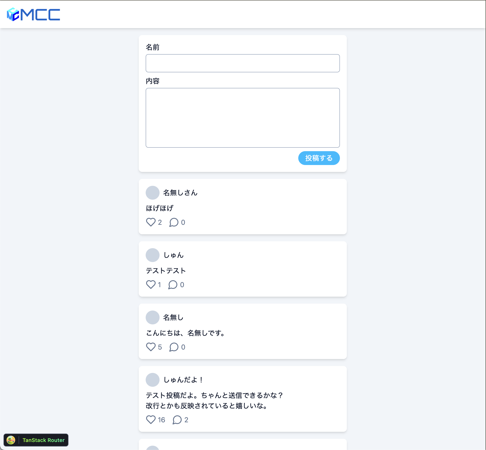

MCC Webアプリ講習会にようこそ！
Webアプリ講習会では、講習会内で実際に1つのWebアプリを開発し、その開発を通じてWebアプリ開発の基礎を学びます。

作成するアプリは「**Twitter風掲示板アプリ**」です。
短文の文章を投稿でき、投稿に対していいねや返信が可能です。
非常にシンプルなアプリですが、Webアプリの基本的なパターンを学ぶのには最適です。

講習会内では、Webアプリの開発方法はもちろんのこと、HTTPやHTML/CSS/JavaScriptといったWebの基本知識も解説します。
ただ、どうしてもこういった内容は全てを説明するのは難しいため、説明は最低限に留め、実際にコードを書く方を中心する予定です。
もしも講習会でこういった知識に興味を持った場合は、ぜひ自分で調べて見てください。
もちろん、自分に聞いてもらっても構いません。
