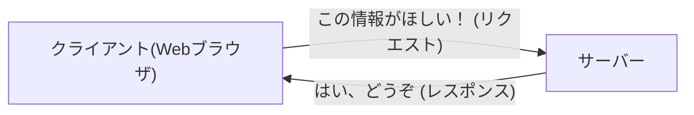
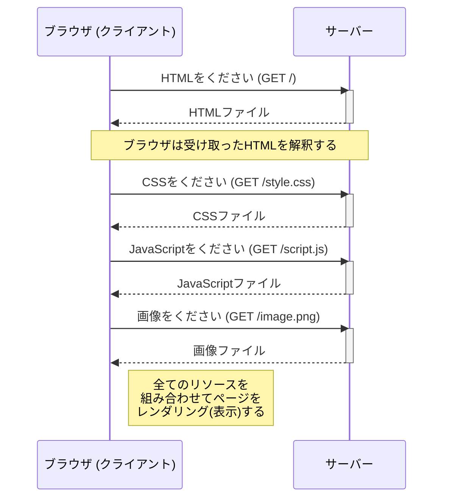
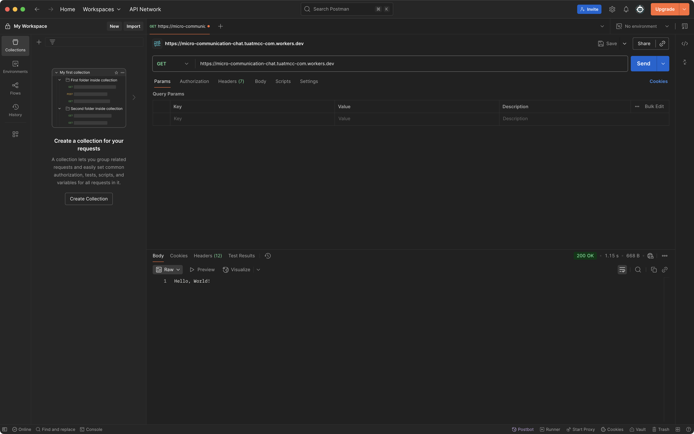

import { Aside } from "@astrojs/starlight/components"

この講習会ではWebアプリを開発していきますが、そもそもWebアプリとは何でしょうか？
Webサイトとは何が違うのでしょうか？

簡単に言えば、Webアプリは「**Webブラウザ上で動作するアプリケーション**」のことです。
みなさんが普段使っているTwitter(X)やYouTube、GmailなどもWebアプリの一種です。
Webサイトは主に情報の閲覧を目的としていますが、Webアプリはユーザーが何らかの操作を行い、その結果が動的に変化するような、より複雑な機能を提供します。

<Aside type="note">
  とはいえ、WebサイトとWebアプリの境界は曖昧であり、両者に技術的な違いはありません。
</Aside>

## クライアント-サーバーモデル

Webアプリの仕組みを理解する上で重要なのが「**クライアント-サーバーモデル**」です。
Webアプリは、私たちの手元にあるPCやスマートフォン（**クライアント**）と、インターネットの向こう側にあるコンピューター（**サーバー**）が互いに通信することで成り立っています。

- **クライアント**: ユーザーが操作する端末のこと。Webブラウザなどがクライアントの役割を担います。Webアプリの画面を表示したり、ユーザーの操作を受け付けたりします。
- **サーバー**: データや機能を提供するコンピューターのこと。クライアントからの要求（リクエスト）に応じて、データを提供したり、処理を実行したりします。

この2者間のやり取りを簡単に図で表すと、以下のようになります。



クライアントが「このページが見たい」「この情報を投稿したい」といった要求（**リクエスト**）をサーバーに送り、サーバーがその要求を処理して結果（**レスポンス**）をクライアントに返す、という流れが基本です。

この講習会で作成するTwitter風アプリも、このモデルに基づいています。
皆さんのブラウザ（クライアント）が、投稿データをサーバーに送信したり、タイムラインの表示をサーバーに要求したりすることで、アプリケーションとして機能します。

## HTTPとは？

クライアントとサーバーが対話するためには、共通の言語、つまりルールが必要です。そのルールが **HTTP (Hyper Text Transfer Protocol)** です。
HTTPは、Webの世界で標準的に使われている通信プロトコル（通信規約）で、「リクエスト」と「レスポンス」の形式を定めています。

例えば、ブラウザでWebページを見るとき、内部では以下のようなやり取りが行われています。
この流れをシーケンス図で見てみましょう。



ブラウザは最初にHTMLファイルを取得し、その内容を解釈します。
HTMLの中にCSS、JavaScript、画像などのへのリンクが含まれている場合、ブラウザはそれらのリソースをサーバーに一つずつ追加でリクエストします。
そして、全ての必要なリソースが揃ったら、それらを組み合わせて最終的なWebページを画面に表示（レンダリング）するのです。

## HTML/CSS/JavaScriptとは？

先ほどのシーケンス図で、ブラウザがHTMLファイル、CSSファイル、JavaScriptファイルなどを取得していることを説明しました。
これらは、Webページを構成する基本的な技術です。簡単に説明すると、以下のような役割を持っています。

- **HTML (Hyper Text Markup Language)**: Webページの骨組み（構造）を定義する言語です。見出し、段落、リスト、リンク、画像といった要素を「タグ」を使って配置します。
- **CSS (Cascading Style Sheets)**: Webページの見た目（スタイル）を定義する言語です。文字の色や大きさ、背景、レイアウトなど、デザインに関する部分を担当します。
- **JavaScript**: Webページに動き（動的な機能）を追加するプログラミング言語です。ユーザーのクリック操作に反応して表示を変えたり、サーバーと非同期で通信して新しい情報を取得したりできます。

これらの関係を「家」に例えると、**HTMLが柱や壁などの構造**、**CSSが壁紙や塗装などの内装・外装**、そして**JavaScriptが自動ドアやエレベーターなどの設備**に相当します。この3つが組み合わさることで、リッチなWebページが作られています。

### 簡単な例

具体的なコードで見てみましょう。

```html title="index.html"
<!DOCTYPE html>
<html>
<head>
  <title>簡単な例</title>
  <link rel="stylesheet" href="style.css">
</head>
<body>
  <h1>私のプロフィール</h1>
  <p>こんにちは、私の名前は田中太郎です。</p>
  <button id="greet-button">挨拶する</button>
  <script src="script.js"></script>
</body>
</html>
```

```css title="style.css"
h1 {
  color: #3366cc; /* 少し落ち着いた青色 */
}

p {
  font-size: 16px;
}

button {
  background-color: #228b22; /* フォレストグリーン */
  color: white;
  padding: 10px 15px;
  border: none;
  border-radius: 5px;
  cursor: pointer;
}
```

```javascript title="script.js"
const greetButton = document.getElementById('greet-button');

greetButton.addEventListener('click', function() {
  alert('こんにちは！Webアプリの世界へようこそ！');
});
```

この例では、

1.  HTMLが `h1` (見出し)、`p` (段落)、`button` (ボタン) という構造を定義しています。また、CSSやJavaScriptのファイルへのリンクを記述しています。
2.  CSSがそれぞれの要素に色やサイズといったスタイルを適用しています。
3.  JavaScriptがボタンを見つけ出し、「クリックされたらアラートを出す」という動作を加えています。

このように、3つの技術がそれぞれの役割を果たし、連携することで1つのWebページが完成するのです。


## APIを実際に叩いてみよう

さて、ここまでクライアントとサーバーがHTTPで通信するという話をしてきました。
Webアプリでは、多くの場合クライアント（ブラウザ）はサーバーに対して「このデータが欲しい」「このデータを保存してほしい」といった要求をします。このときのやり取りの窓口となるのが **API (Application Programming Interface)** です。
広義の意味ではAPIは異なるソフトウェア同士が情報をやり取りするためのインターフェイスやその仕様のことですが、Webアプリの場合はサーバーが提供するサービスのことを指すことが多いです。

サーバーは「このURLに、こういう形式でリクエストを送ってくれれば、こういうデータを返しますよ」というルールをAPIとして定義しておきます。クライアントはそのルールに従ってサーバーと通信することで、必要な機能を実現します。

言葉で説明しても分かりにくいので、実際にAPIを叩いてみましょう。
このハンズオンのために用意されたサーバーには、いくつかのAPIがあります。ここではそのうちの一つ、挨拶を返してくれるAPIを試してみます。

### PostmanでAPIを叩く

環境構築のパートでインストールしたPostmanを使います。
Postmanを起動してください。

1.  まず、`+` ボタンを押して新しいリクエストを作成します。
2.  メソッドを `GET` に設定します。
3.  URL入力欄に `https://micro-communication-chat.tuatmcc-com.workers.dev` と入力します。
5.  `Send` ボタンを押してリクエストを送信します。



成功すれば、画面下部のレスポンスボディに以下のようなテキストが返ってくるはずです。

```text
Hello, World!
```

これは、サーバーがあなたのリクエストを受け取り、「`Hello, World!`」という文字列を返してくれたことを意味します。
これが、クライアントとサーバー間の最も基本的なやり取りです。

ここではPostmanを使ってみましたが、実際にはブラウザ上でも同じようにAPIを叩くことができます。
実際にブラウザのURL欄に `https://micro-communication-chat.tuatmcc-com.workers.dev` と入力してみてください。
すると、同じように `Hello, World!` という文字列が返ってくるはずです。

また、リクエストにはクエリパラメータという追加情報を追加することができます。
PostmanでParamsタブを開き、`Key`に `name`、`Value`に `Taro` と入力してください。
すると上のURLに `?name=Taro` が追加されます。
この状態でリクエストを送信すると、`Hello, Taro!` という文字列が返ってくるはずです。


このように、クエリパラメータを追加することで、リクエストに対してサーバーが返すデータを変えることができます。
